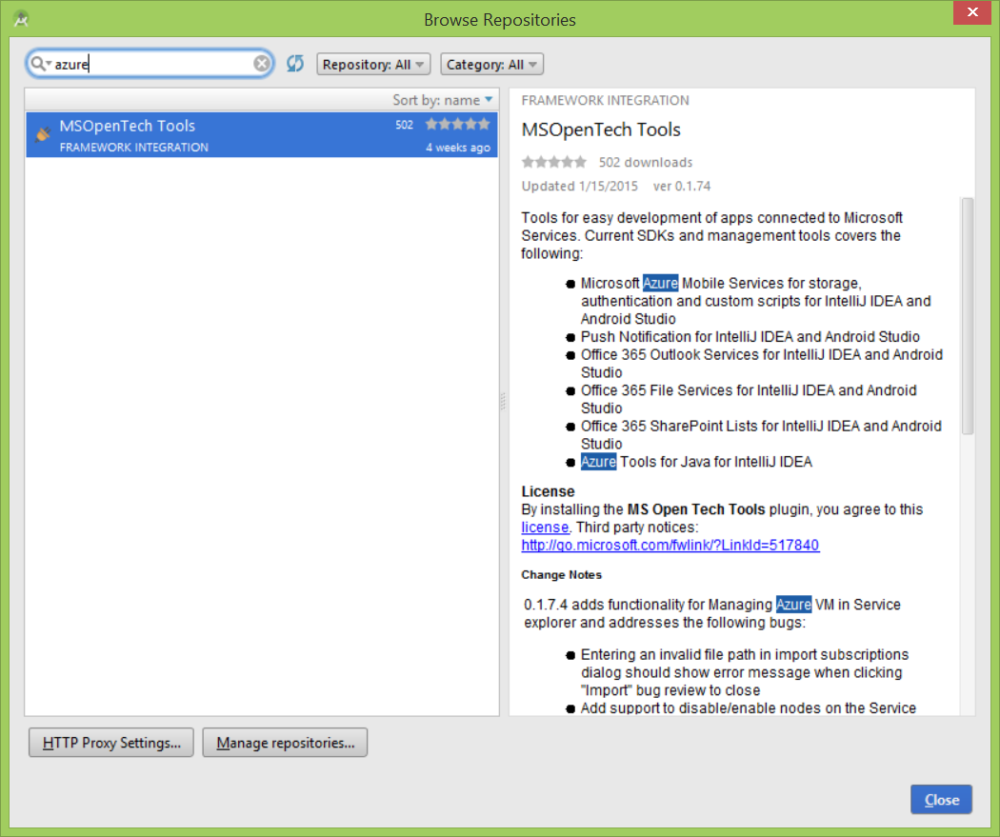
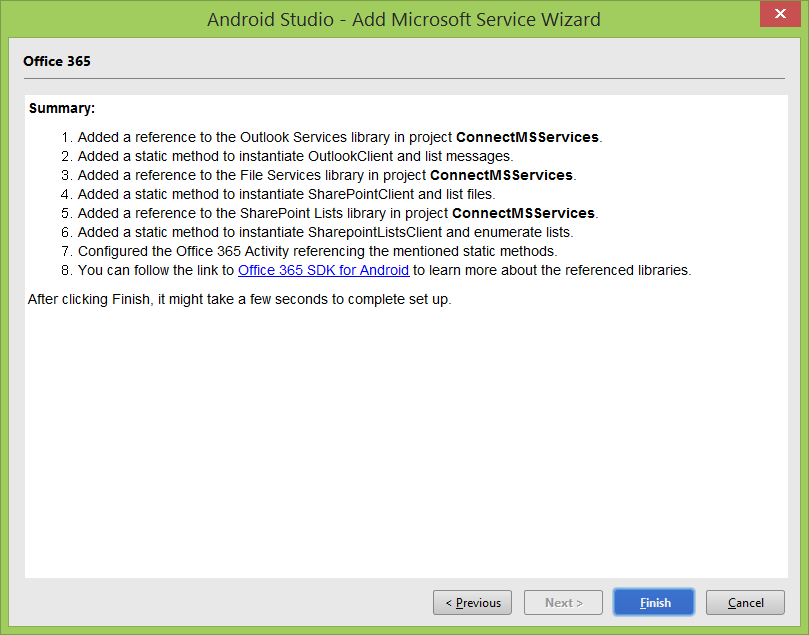
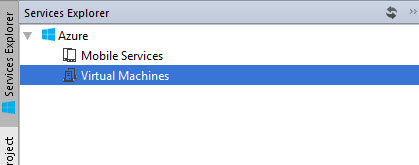
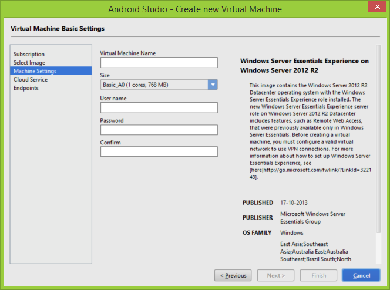
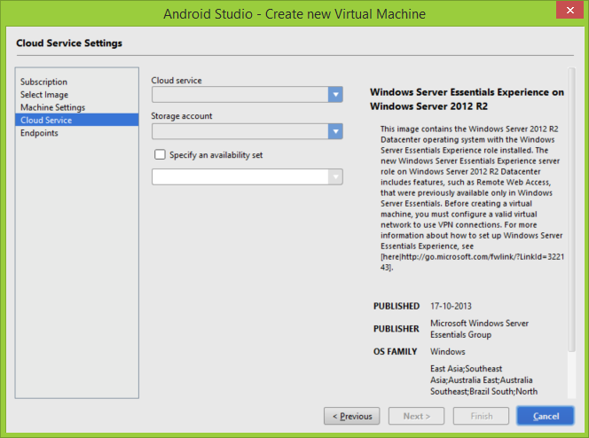
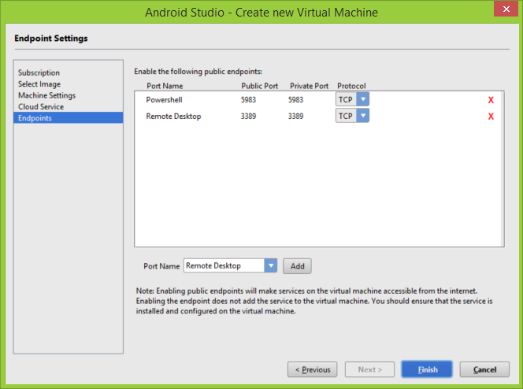

# Get started with MS Open Tech Tools for Android #
This tutorial shows you how to install MS Open Tech Tools for Android, add cloud-based back-end services to an Android app using Azure Mobile Services, Notification Hub, and Office365 Services. It also provides information on the Services Explorer tool window which you can use to manage Azure assets such as Azure Virtual Machine or Azure Mobile Services.
 
### Prerequisites ##
The Microsoft Services plugin works with both [IntelliJ IDEA](http://www.jetbrains.com/idea/) and [Android Studio](http://developer.android.com/sdk/installing/studio.html). 
To use the plugin, you must install the following : 

1. Android SDK - [http://developer.android.com/sdk/index.html](http://developer.android.com/sdk/index.html) minimum version is Android 2.3 / API 9. 

1. Java JRE 1.6 and above - [http://www.oracle.com/technetwork/java/javase/downloads/index.html ](http://www.oracle.com/technetwork/java/javase/downloads/index.html)
3.	Azure account. If you don't have an account, you can create a free trial account in just a couple of minutes. For details, see [Azure Free Trial](http://www.windowsazure.com/en-us/pricing/free-trial/?WT.mc_id=AE564AB28).
Once you have the Azure account, download the .publishsettings file 
[https://manage.windowsazure.com/publishsettings](https://manage.windowsazure.com/publishsettings) 

In addition, you must have Open SSL installed. Many Linux distributions have pre-compiled OpenSSL packages installed. For the Windows OS, you can  manually install latest Open SSL version from [http://www.openssl.org/about/binaries.html](http://www.openssl.org/about/binaries.html)

Once you have installed Open SSL to your local machine, add the installation location to the system environment variable PATH.

For example, if you run on Win64 you’ll need to install Win64 OpenSSL v1.0.1j. to local folder for example C:\OpenSSL-Win64\. After installation is complete open the Windows System environment variables and in the PATH add “C:\OpenSSL-Win64\bin”.

### Install Microsoft Open Tech Plugin  

Both IntelliJ and Android Studio allow you to install the plugin by following the usual plugin installation steps that involves navigating to File > Settings > Plugins.

In the Settings window select Plugins and in the Plugin window select Browse repositories. 

 
You may search for the plugin by using keywords like "MSOpenTech" or "Azure" or "Office". 

### Install the plugin inside IntelliJ or Android Studio

 
The same steps will apply to Android Studio. Both Android Studio and IntellliJ will require to restart the IDE to finish the plugin installation.  
### Create a new Android App in IntelliJ ##
Follow these steps to create a new mobile service:

- Open IntelliJ
- Select Create new Android project of type Gradle:Android Module. Note that in v0.1 the only supported project is Gradle type.

  

•	Name the project and hit Next 

 

•	Select Blank Activity

 
In the following dialog leave the default Activity name “Main Activity” and click next 

In the following dialog after validating the name and location of the project click Finish.

### Create a new Android App in Android Studio ##
Create a new project 

 

 

Select No activity in the following window 

 
Click Finish.

### Connect to an Azure Mobile Service and Notification Hub and generate the helper classes ##

### A.	Create an Azure Services Activity ##
 
Navigate to you project tree and right click on the app folder

 
In the activity template select the services you are interested in. Based on your selection the corresponding Android SDKs will be downloaded on your disk 

This will prompt you to set up the Azure subscriptions and manage the Azure Mobile service you want to connect to the project without having to go back and forth between the Azure portal and Android Studio. 

### <a name="managesub">B.	Manage Subscriptions<a/> ##

 
To get the Azure subscription you need to either download the Azure publish settings file by selecting Add Subscription/Import either by selecting the Add Subscription/SignIn

Add Subscription/Import allows you to import the Azure Publish settings file. First you’ll need to download the subscription file indicated in the link and save the file locally. 

 
This will open a browser to the profile info download page in the Azure Portal. The download will proceed automatically, unless the browser is not logged in to the Azure Portal, which will cause to prompt for credentials, and then proceed to the download. The browser will prompt you to save the publish settings file. 

Once the file is downloaded, select it in the dialog by pressing the "Browse" button.

 

Once the File is selected press Import button.

 
This should close the dialog, and return to the manage subscription dialog, which should show the list of subscriptions associated with your Azure Account.

Another way to load the subscription files is to Add Subscription/Sign In.

 
In the Manage subscription dialog select the Subscription and click Ok.

### C.	Create an Azure Mobile Service and connect it to your App  ##

If you have created already an Azure Mobile Service with the Azure Portal the Android Studio Microsoft Service wizard will prepopulate that so you can connect an existing project to your app. 

 
If the service does not exist click on the + button to create one without having to switch to Azure portal. 

 
Once you hit Create a new service is added in the Android Studio Microsoft Service wizard

By clicking Next if previously you selected a Notification Hub you will be prompted to configure the Notification Hub Service. 

 
For more details about Notification Hub see [http://azure.microsoft.com/en-us/documentation/articles/notification-hubs-android-get-started/](http://azure.microsoft.com/en-us/documentation/articles/notification-hubs-android-get-started/) 

After selecting Next button you will be prompted with the summary of the changes to your project: 

 
The following was created to the project: helper classes for Notification Hub and Azure Mobile Services and an Azure Service Activity.  Inside the Azure Service activity you will see a starter code that obtains the mobileServiceClient object for basic operations with the tables and custom APIs and an example of how to configure the NotificationHub. 

 
### Connect to an Azure Mobile Service and Notification Hub and generate the helper classes ##
### A.	Create an Azure Services Activity 
In the project tree right click on the app  

 

This will generate an Android Studio Activity with the Office365 services:

 
Clicking Finish will allow developer to login and register to the Office365 services 

 
After selecting the appropriate permissions for the application the developer will see a screen with the summary of all the changes applied to the project.  

The following SDKs are added to the project in the libraries:

- Outlook Services
-	FileServices
-	SharepointLists

This following java classes will be generated

- An Office365Activity with conecting to…
-	FileServicesClient
-	ListServicesClient 

### Using The Services Explorer

The IntelliJ and Android Studio plugin provides a Services Explorer that allows you to manage Microsoft Azure services without having to open a browser and log in to the Azure management portal.

Currently the Services Explorer allows you to manage Azure Mobile Services and Virtual Machines. 

The following procedure shows you how to create and manage a VM using the Services Explorer.

Go to View > Tool Windows > Services Explorer from the menu bar to open the Services Explorer navigation tree.

Before you can create a VM, you must sign in to your subscription or import your Azure publish settings file. 

To manage your subscriptions, right click the Azure root node in the navigation tree. For more information on importing the settings, see the <a href="#managesub">Manage Subscriptions</a> section above.

Once you have finished signing in, you can create a new VM.

Expand the Azure root node and right click Virtual Machines, then select Create VM from the context menu.

From the dropdown on the Create new Virtual Machine Subscription dialog, select the subscription in which you will create the new VM and click Next.

On the Create new Virtual Machine Select Image dialog, select an image type in the Image type dropdown list box, and then select a virtual machine images in the Image Label list box. When you're done, click Next.

You can choose the following image types.

- Public Images lists virtual machine images of operating systems and server software such as Windows Server and SQL Server.
- MSDN Images lists virtual machine images of software available to MSDN subscribers, such as Visual Studio and Microsoft Dynamics.
- Private Images lists specialized and generalized virtual machine images that you've created.

You can click a virtual machine image name to see information about the image on the right side of the page.

 To learn about specialized and generalized virtual machines, see [VM Image](http://azure.microsoft.com/blog/2014/04/14/vm-image-blog-post/). See [How to Capture a Windows Virtual Machine to Use as a Template](http://azure.microsoft.com/en-us/documentation/articles/virtual-machines-capture-image-windows-server/) for information about how to turn a virtual machine into a template that you can use to quickly create new pre-configured virtual machines.

On the Create new Virtual Machine Machine Settings dialog, enter a name for the virtual machine that you will use to identify it. This name should be descriptive of how you are using the VM, but short enough to be easy to use.

From the Size dropdown, select a size for your VM. If you discover you need to adjust the size and other settings after you create the Azure virtual machine, you can do so in the [Azure Management Portal](https://manage.windowsazure.com/).

Note: If you choose larger sizes for the virtual machine, extra charges may apply. See [Virtual Machines Pricing Details](http://azure.microsoft.com/en-us/pricing/details/virtual-machines/) for more information. 

Enter a user name and password for the administrative user of the VM and click Next.

On the Create new Virtual Machine Cloud Service dialog, select the Cloud service and Storage account in which the VM will be created. If you are creating a new Cloud Service or a new Storage account, the names you select must be unique within all of Microsoft Azure. For more information, see [Cloud Services](http://azure.microsoft.com/en-us/services/cloud-services/) and [About Azure Storage Accounts](http://azure.microsoft.com/en-us/documentation/articles/storage-whatis-account/).

If you want your virtual machine to belong to an availability set (optional), select the Specify an availability set check box and then choose an availability set in the dropdown list box. When you're done, choose the Next button.

Adding your virtual machine to an availability set helps your application stay available during network failures, local disk hardware failures, and any planned downtime. You need to use the Azure Management Portal to create virtual networks, subnets, and availability sets. For more information, see [Manage the Availability of Virtual Machines](http://azure.microsoft.com/en-us/documentation/articles/virtual-machines-manage-availability/).

On the Create new Virtual Machine Endpoints dialog, add any additional endpoints that your VM will use and click Next. For example, this is where you would add an endpoint for SSH.

The endpoints that are available depend on the cloud service you selected for your virtual machine. For more information, see [Azure Service Endpoints](https://msdn.microsoft.com/library/azure/dn268600.aspx).

### Managing VMs

Once you have created a VM, it shows up in your Services Explorer navigation tree under the Virtual Machines node.

To manage your VM, you can right click the machine name to open the management context menu.

From the context menu, you can Start, Restart, Shutdown, Refresh, and Delete the VM as needed.

You can also create an RDP session file that you can use to open an RDP connection to Windows VMs.